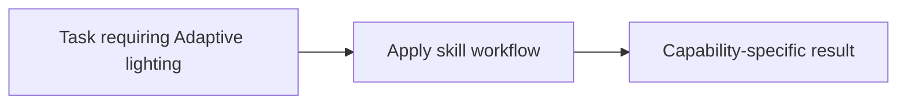

# Adaptive lighting

<!-- directory-responsibility -->
Provides the Adaptive lighting skill. Use this skill when working with the Home Assistant Adaptive Lighting integration, including YAML or UI configuration, switch entities, service calls, manual control behavior, option tuning, and troubleshooting.

Key files: `SKILL.md`.

Git tracking defaults to exclusion. Each tracked directory owns a `.gitignore` that explicitly allows its important immediate files and child directories. Add an allowlist entry when introducing content intended for version control, and give each new child directory its own `.gitignore`. This repository applies the workspace policy independently; its root rules cover root entries only. Existing responsibilities and the diagram remain unchanged.
