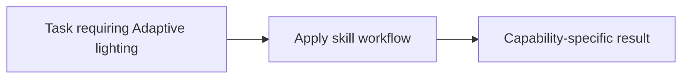

# Adaptive lighting

<!-- directory-responsibility -->
Provides the Adaptive lighting skill. Use this skill when working with the Home Assistant Adaptive Lighting integration, including YAML or UI configuration, switch entities, service calls, manual control behavior, option tuning, and troubleshooting.

Key files: `SKILL.md`.

