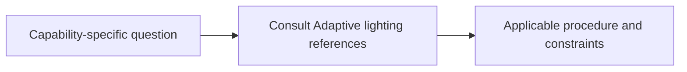

# References

<!-- directory-responsibility -->
Supplies supporting guidance for Adaptive lighting, covering configuration and troubleshooting.

Key files: `configuration-and-troubleshooting.md`.

```mermaid
flowchart LR
    A["Capability-specific question"] --> B["Consult Adaptive lighting references"]
    B --> C["Applicable procedure and constraints"]
```
