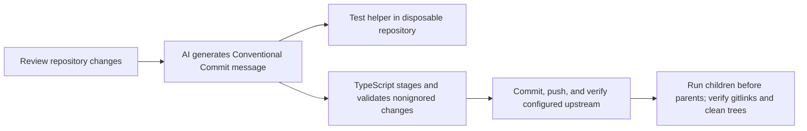

# Repository commits

Owns the workflow for reviewing and publishing changes across a repository and its initialized submodules. [SKILL.md](SKILL.md) defines review and child-before-parent execution. [commit.ts](commit.ts) deterministically stages nonignored changes, validates, commits with the AI-generated Conventional Commit message, pushes, and verifies the configured upstream. Test the helper only in a disposable repository.

