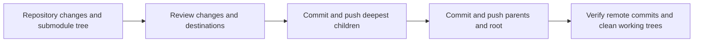

# Repository commits

Owns the workflow for reviewing and publishing changes across a repository and its initialized submodules. [SKILL.md](SKILL.md) defines review, authorization, child-before-parent publication, and final verification. Initialized submodules stay on `main`, preserving and integrating their existing commits. Repository remotes supply publication destinations; repository instructions supply applicable checks.

