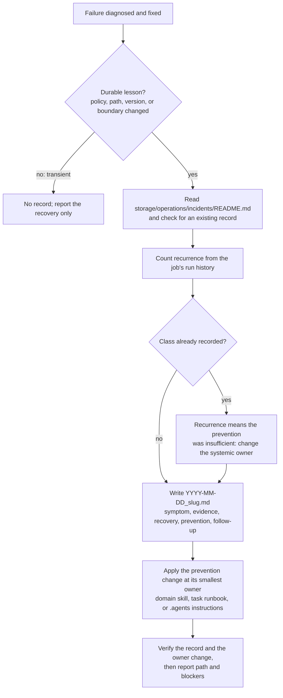

# Anoblet-incident-record

Record a runtime incident and its prevention step after a failure is diagnosed and fixed. The entrypoint defines when a record is required, what it must contain, and which owner receives the prevention change. It also requires counting the recurrence from the affected job's run history, because a class that recurs after a prevention step was already applied needs a different systemic change rather than another per-incident note.

Files: [SKILL.md](SKILL.md).

Git tracking is controlled by this directory's `.gitignore`: new entries are ignored until explicitly allowed. The responsibility description and diagram were reviewed for this policy.
