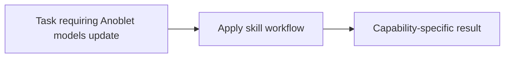

# Anoblet models update

<!-- directory-responsibility -->
Provides the Anoblet models update skill. Update an OpenClaw configuration's available model catalog from the OpenClaw CLI, using Codex OAuth for OpenAI and preserving fallback settings.

Key files: `SKILL.md`.

