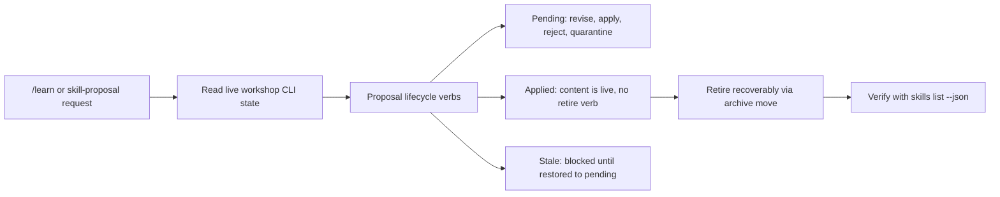

# Anoblet skill workshop

<!-- directory-responsibility -->

Provides the Skill Workshop lifecycle skill. Handle `/learn` and learning-from-recent-work requests, and stage, apply, revise, reject, quarantine, or retire a Workshop skill proposal without corrupting a live skill.

Key files: `SKILL.md`.

Git tracking defaults to exclusion. Each tracked directory owns a `.gitignore` that explicitly allows its important immediate files and child directories. Add an allowlist entry when introducing content intended for version control, and give each new child directory its own `.gitignore`. This repository applies the workspace policy independently; its root rules cover root entries only.
