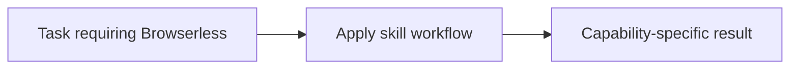

# Browserless

<!-- directory-responsibility -->
Provides the Browserless skill. Use Browserless to scrape pages, capture screenshots or PDFs, export rendered content, download files, or run browser automation through REST, WebSocket, or MCP integrations when the task depends on live web state rather than static HTTP alone.

Key files: `SKILL.md`.

Git tracking defaults to exclusion. Each tracked directory owns a `.gitignore` that explicitly allows its important immediate files and child directories. Add an allowlist entry when introducing content intended for version control, and give each new child directory its own `.gitignore`. This repository applies the workspace policy independently; its root rules cover root entries only. Existing responsibilities and the diagram remain unchanged.
