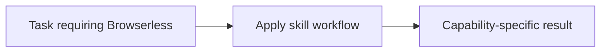

# Browserless

<!-- directory-responsibility -->
Provides the Browserless skill. Use Browserless to scrape pages, capture screenshots or PDFs, export rendered content, download files, or run browser automation through REST, WebSocket, or MCP integrations when the task depends on live web state rather than static HTTP alone.

Key files: `SKILL.md`.

