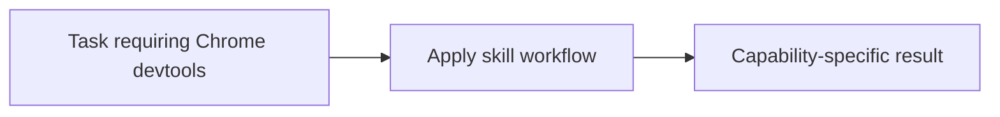

# Chrome devtools

<!-- directory-responsibility -->
Provides the Chrome devtools skill. Use Chrome DevTools MCP to inspect and control a live browser when a task depends on rendered state, console output, network traffic, audits, or performance traces instead of static code alone.

Key files: `SKILL.md`.

