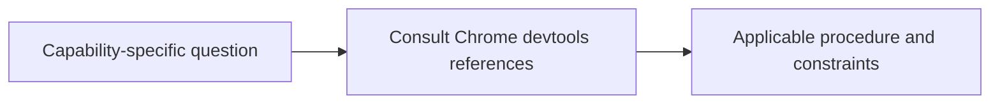

# References

<!-- directory-responsibility -->
Supplies supporting guidance for Chrome devtools, covering workflows.

Key files: `workflows.md`.

```mermaid
flowchart LR
    A["Capability-specific question"] --> B["Consult Chrome devtools references"]
    B --> C["Applicable procedure and constraints"]
```
