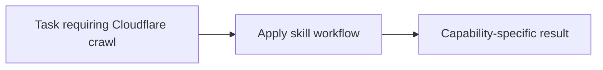

# Cloudflare crawl

<!-- directory-responsibility -->
Provides the Cloudflare crawl skill. Use Cloudflare's crawl endpoint to run bounded asynchronous site crawls when a task needs multi-page extraction, documentation ingestion, or structured results from one starting URL.

Key files: `SKILL.md`.

