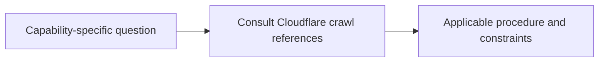

# References

<!-- directory-responsibility -->
Supplies supporting guidance for Cloudflare crawl, covering request recipes.

Key files: `request-recipes.md`.

```mermaid
flowchart LR
    A["Capability-specific question"] --> B["Consult Cloudflare crawl references"]
    B --> C["Applicable procedure and constraints"]
```
