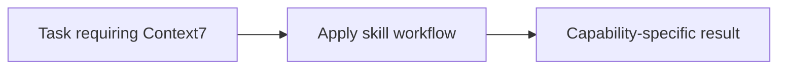

# Context7

<!-- directory-responsibility -->
Provides the Context7 skill. Use Context7 to look up current third-party library and framework documentation, API references, setup guidance, and version-specific code examples when a task depends on external package behavior rather than model memory alone.

Key files: `SKILL.md`.

