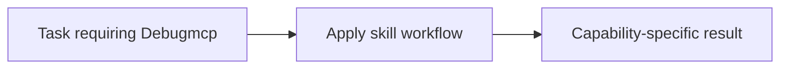

# Debugmcp

<!-- directory-responsibility -->
Provides the Debugmcp skill. Use debugger-control capabilities such as session start, breakpoints, stepping, variable inspection, and expression evaluation when a task requires runtime evidence instead of static inspection alone.

Key files: `SKILL.md`.

Git tracking defaults to exclusion. Each tracked directory owns a `.gitignore` that explicitly allows its important immediate files and child directories. Add an allowlist entry when introducing content intended for version control, and give each new child directory its own `.gitignore`. This repository applies the workspace policy independently; its root rules cover root entries only. Existing responsibilities and the diagram remain unchanged.
