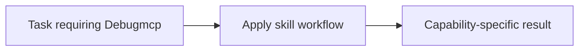

# Debugmcp

<!-- directory-responsibility -->
Provides the Debugmcp skill. Use debugger-control capabilities such as session start, breakpoints, stepping, variable inspection, and expression evaluation when a task requires runtime evidence instead of static inspection alone.

Key files: `SKILL.md`.

