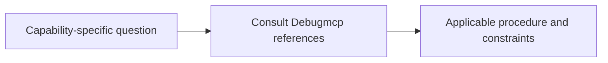

# References

<!-- directory-responsibility -->
Supplies supporting guidance for Debugmcp, covering troubleshooting, workflow.

Key files: `troubleshooting.md`, `workflow.md`.

```mermaid
flowchart LR
    A["Capability-specific question"] --> B["Consult Debugmcp references"]
    B --> C["Applicable procedure and constraints"]
```
