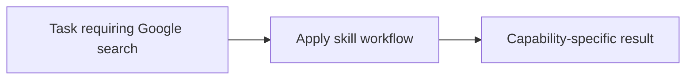

# Google search

<!-- directory-responsibility -->
Provides the Google search skill. Use the google-search-mcp server for current Google search results when static documentation or local knowledge is insufficient.

Key files: `SKILL.md`.

