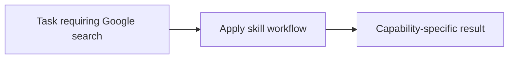

# Google search

<!-- directory-responsibility -->
Provides the Google search skill. Use the google-search-mcp server for current Google search results when static documentation or local knowledge is insufficient.

Key files: `SKILL.md`.

Git tracking defaults to exclusion. Each tracked directory owns a `.gitignore` that explicitly allows its important immediate files and child directories. Add an allowlist entry when introducing content intended for version control, and give each new child directory its own `.gitignore`. This repository applies the workspace policy independently; its root rules cover root entries only. Existing responsibilities and the diagram remain unchanged.
