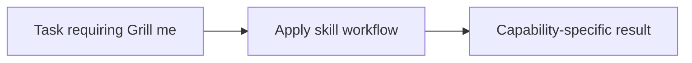

# Grill me

<!-- directory-responsibility -->
Provides the Grill me skill. Interview the user relentlessly about a plan or design until reaching shared understanding, resolving each branch of the decision tree. Use when user wants to stress-test a plan, get grilled on their design, or mentions "grill me".

Key files: `SKILL.md`.

