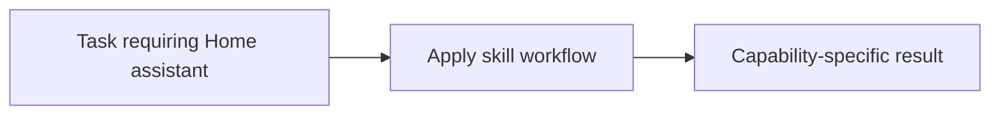

# Home assistant

<!-- directory-responsibility -->
Provides the Home assistant skill. Use official Home Assistant concepts and documentation to work on configuration, automations, templates, integrations, frontend, dashboards, and debugging without assuming repository-specific wrappers or layouts.

Key files: `SKILL.md`.

