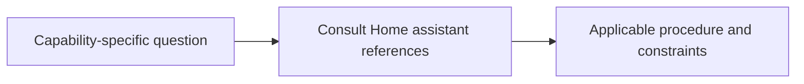

# References

<!-- directory-responsibility -->
Supplies supporting guidance for Home assistant, covering configuration and automations, development paths, templates and debugging.

Key files: `configuration-and-automations.md`, `development-paths.md`, `templates-and-debugging.md`.

