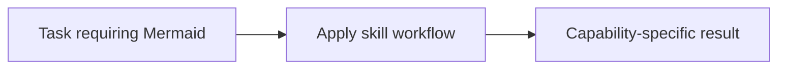

# Mermaid

<!-- directory-responsibility -->
Provides the Mermaid skill. Use Mermaid to create text-based diagrams such as flowcharts, sequence diagrams, state machines, ER diagrams, timelines, and architecture views when a task needs a lightweight visual model in Markdown or source control.

Key files: `SKILL.md`.

