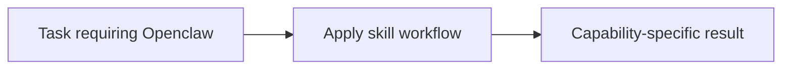

# Openclaw

<!-- directory-responsibility -->
Provides the Openclaw skill. Create, inspect, or update OpenClaw scheduled tasks, validate announcement delivery, and preserve verified corrections through self-refinement. Use for OpenClaw cron/task CLI work; do not use for unrelated application scheduling.

Key files: `SKILL.md`.

Git tracking defaults to exclusion. Each tracked directory owns a `.gitignore` that explicitly allows its important immediate files and child directories. Add an allowlist entry when introducing content intended for version control, and give each new child directory its own `.gitignore`. This repository applies the workspace policy independently; its root rules cover root entries only. Existing responsibilities and the diagram remain unchanged.
