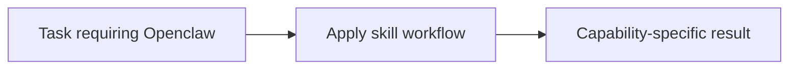

# Openclaw

<!-- directory-responsibility -->
Provides the Openclaw skill. Create, inspect, or update OpenClaw scheduled tasks, validate announcement delivery, and preserve verified corrections through self-refinement. Use for OpenClaw cron/task CLI work; do not use for unrelated application scheduling.

Key files: `SKILL.md`.

