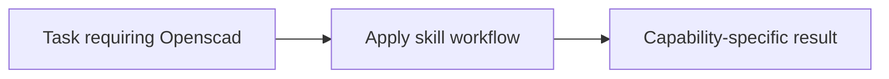

# Openscad

<!-- directory-responsibility -->
Provides the Openscad skill. Use OpenSCAD to generate or refine script-based 3D models from SVG artwork, PNG heightmaps, photos, and other reference images, validate them with a local OpenSCAD executable, and iterate with optional BOSL2 support when image-driven workflows need more than native primitives.

Key files: `SKILL.md`.

Git tracking defaults to exclusion. Each tracked directory owns a `.gitignore` that explicitly allows its important immediate files and child directories. Add an allowlist entry when introducing content intended for version control, and give each new child directory its own `.gitignore`. This repository applies the workspace policy independently; its root rules cover root entries only. Existing responsibilities and the diagram remain unchanged.
