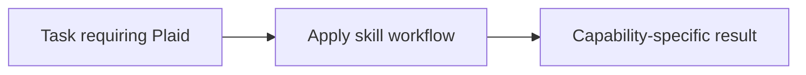

# Plaid

<!-- directory-responsibility -->
Provides the Plaid skill. Use the @anoblet/copilot-plaid CLI to retrieve financial transactions and account data from the Plaid API, supporting sandbox and production environments with JSON or text output.

Key files: `SKILL.md`.

