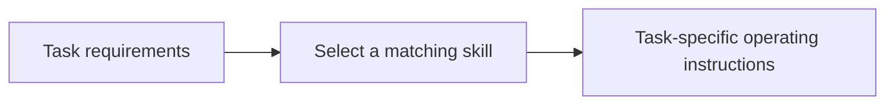

# Skills

<!-- directory-responsibility -->
Owns discoverable skill entrypoints for repository tasks. Each child skill defines its own scope and workflow.

```mermaid
flowchart LR
    A["Task requirements"] --> B["Select a matching skill"]
    B --> C["Task-specific operating instructions"]
```
