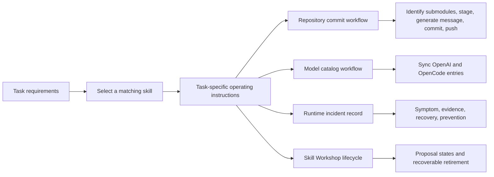

# Skills

<!-- directory-responsibility -->

Owns discoverable skill entrypoints for repository tasks. Each child skill defines its own scope and workflow, including the workspace commit workflow at [anoblet-commit](anoblet-commit/readme.md), the OpenClaw model catalog workflow at [anoblet-models-update](anoblet-models-update/readme.md), the runtime incident record at [anoblet-incident-record](anoblet-incident-record/readme.md), and the Skill Workshop lifecycle at [anoblet-skill-workshop](anoblet-skill-workshop/readme.md).

Git tracking defaults to exclusion. Each tracked directory owns a `.gitignore` that explicitly allows its important immediate files and child directories. The `anoblet-commit`, `anoblet-models-update`, `anoblet-incident-record`, and `anoblet-skill-workshop` child allowlists track their `SKILL.md` and overview; the workspace exposes those tracked sources through relative symlinks. This repository applies the workspace policy independently; its root rules cover root entries only.
