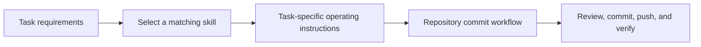

# Skills

<!-- directory-responsibility -->
Owns discoverable skill entrypoints for repository tasks. Each child skill defines its own scope and workflow, including the workspace commit workflow at [anoblet-commit](anoblet-commit/readme.md).

Git tracking defaults to exclusion. Each tracked directory owns a `.gitignore` that explicitly allows its important immediate files and child directories. The `anoblet-commit` child allowlist tracks its `SKILL.md` and overview; the workspace exposes that tracked source through a relative symlink. This repository applies the workspace policy independently; its root rules cover root entries only.
