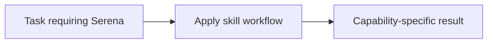

# Serena

<!-- directory-responsibility -->
Provides the Serena skill. Use Serena for semantic code search, symbol-aware navigation, reference tracing, and targeted refactoring in larger codebases when plain text search or whole-file reads would be noisy, slow, or error-prone.

Key files: `SKILL.md`.

