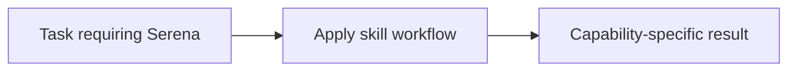

# Serena

<!-- directory-responsibility -->
Provides the Serena skill. Use Serena for semantic code search, symbol-aware navigation, reference tracing, and targeted refactoring in larger codebases when plain text search or whole-file reads would be noisy, slow, or error-prone.

Key files: `SKILL.md`.

Git tracking defaults to exclusion. Each tracked directory owns a `.gitignore` that explicitly allows its important immediate files and child directories. Add an allowlist entry when introducing content intended for version control, and give each new child directory its own `.gitignore`. This repository applies the workspace policy independently; its root rules cover root entries only. Existing responsibilities and the diagram remain unchanged.
