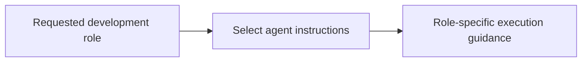

# Agents

<!-- directory-responsibility -->
Defines specialized assistant roles for implementation, review, documentation, research, and related development work.

Key files: `agents-md.agent.md`, `alpha-vantage.agent.md`, `chrome-devtools.agent.md`, `documentation.agent.md`, `implement.agent.md`, `lint.agent.md`, `mermaid.agent.md`, `next.agent.md`, `plan.agent.md`, `playwright.agent.md`.

