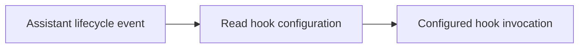

# Hooks

<!-- directory-responsibility -->
Configures lifecycle hooks used by assistant workflows.

Key files: `index.json`.

```mermaid
flowchart LR
    A["Assistant lifecycle event"] --> B["Read hook configuration"]
    B --> C["Configured hook invocation"]
```
