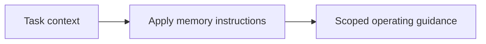

# Memory

<!-- directory-responsibility -->
Provides memory instructions within the development instruction catalog.

Key files: `prompt.instructions.md`.

```mermaid
flowchart LR
    A["Task context"] --> B["Apply memory instructions"]
    B --> C["Scoped operating guidance"]
```
