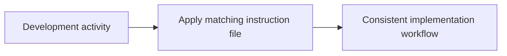

# Instructions

<!-- directory-responsibility -->
Stores development conventions and tool-specific assistant instructions.

Key files: `chrome-devtools.instructions.md`, `copilot.instructions.md`, `css.instructions.md`, `git-flow.instructions.md`, `git.instructions.md`, `home-assistant.instructions.md`, `index.instructions.md`, `inspiration.instructions.md`, `node.instructions.md`, `principles.instructions.md`.

Git tracking defaults to exclusion. Each tracked directory owns a `.gitignore` that explicitly allows its important immediate files and child directories. Add an allowlist entry when introducing content intended for version control, and give each new child directory its own `.gitignore`. This repository applies the workspace policy independently; its root rules cover root entries only. Existing responsibilities and the diagram remain unchanged.
