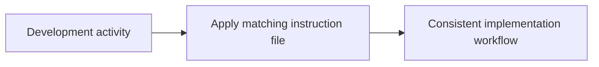

# Instructions

<!-- directory-responsibility -->
Stores development conventions and tool-specific assistant instructions.

Key files: `chrome-devtools.instructions.md`, `copilot.instructions.md`, `css.instructions.md`, `git-flow.instructions.md`, `git.instructions.md`, `home-assistant.instructions.md`, `index.instructions.md`, `inspiration.instructions.md`, `node.instructions.md`, `principles.instructions.md`.

