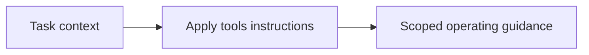

# Tools

<!-- directory-responsibility -->
Provides tools instructions within the development instruction catalog.

Key files: `agent.instructions.md`, `chroma.instructions.md`, `context7.instructions.md`, `github.instructions.md`, `markitdown.instructions.md`, `memory.instructions.md`, `playwright.instructions.md`, `sequential-thinking.instructions.md`, `serena.instructions.md`.

Git tracking defaults to exclusion. Each tracked directory owns a `.gitignore` that explicitly allows its important immediate files and child directories. Add an allowlist entry when introducing content intended for version control, and give each new child directory its own `.gitignore`. This repository applies the workspace policy independently; its root rules cover root entries only. Existing responsibilities and the diagram remain unchanged.
