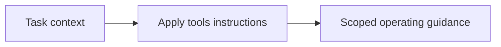

# Tools

<!-- directory-responsibility -->
Provides tools instructions within the development instruction catalog.

Key files: `agent.instructions.md`, `chroma.instructions.md`, `context7.instructions.md`, `github.instructions.md`, `markitdown.instructions.md`, `memory.instructions.md`, `playwright.instructions.md`, `sequential-thinking.instructions.md`, `serena.instructions.md`.

