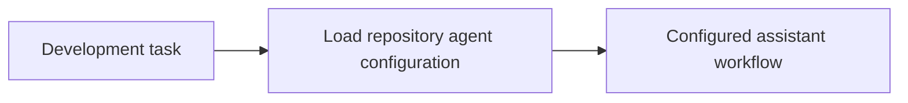

# Github

<!-- directory-responsibility -->
Groups Copilot instructions, specialized agents, prompts, hooks, and related GitHub configuration.

Key files: `copilot-instructions.md`.

Git tracking defaults to exclusion. Each tracked directory owns a `.gitignore` that explicitly allows its important immediate files and child directories. Add an allowlist entry when introducing content intended for version control, and give each new child directory its own `.gitignore`. This repository applies the workspace policy independently; its root rules cover root entries only. Existing responsibilities and the diagram remain unchanged.
