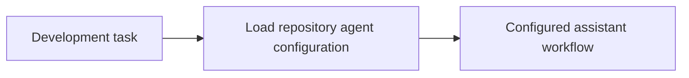

# Github

<!-- directory-responsibility -->
Groups Copilot instructions, specialized agents, prompts, hooks, and related GitHub configuration.

Key files: `copilot-instructions.md`.

```mermaid
flowchart LR
    A["Development task"] --> B["Load repository agent configuration"]
    B --> C["Configured assistant workflow"]
```
