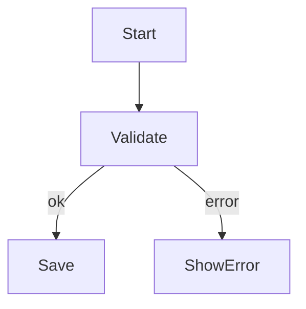
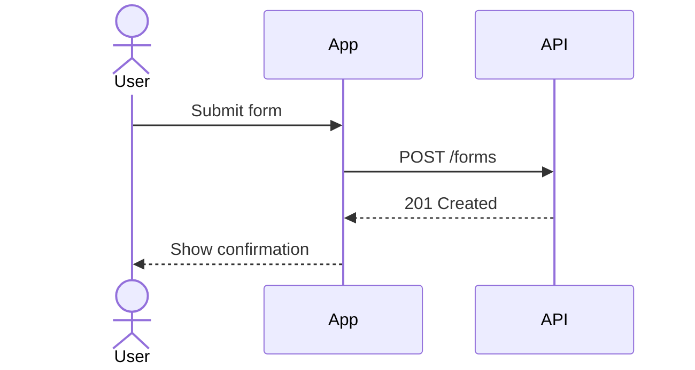
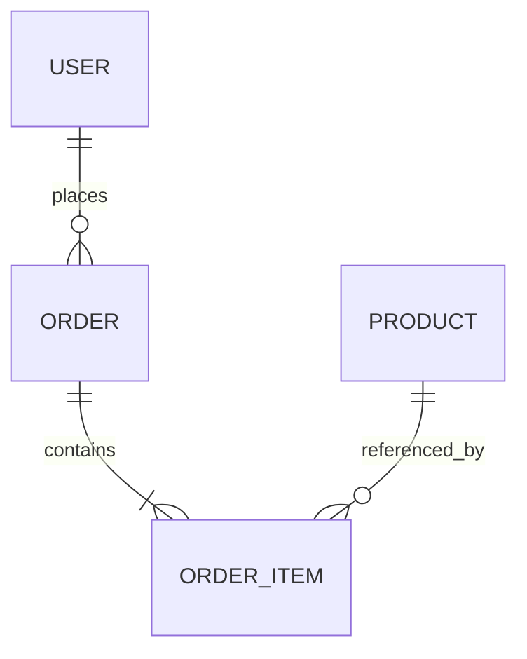

# Mermaid

Use this skill when the task needs a quick diagram that can live in plain text, Markdown, or version control without a separate drawing tool.

## Pick The Right Diagram

- `flowchart` for branching logic, workflows, and simple process maps.
- `sequenceDiagram` for interactions between actors over time.
- `stateDiagram-v2` for lifecycle rules and transitions.
- `classDiagram` or `erDiagram` for structure, entities, and relationships.
- `journey`, `timeline`, `gantt`, `gitGraph`, `mindmap`, `architecture`, or `C4` when the question is about user experience, time, version flow, idea clustering, or high-level system layout.

## Workflow

1. Decide what single question the diagram should answer.
2. Choose the smallest diagram family that fits.
3. Draft the actors, nodes, or entities in plain language.
4. Keep identifiers stable and labels short.
5. Validate syntax incrementally instead of writing a very large diagram in one pass.

## Guardrails

- Do not force every problem into a flowchart.
- Keep one level of abstraction per diagram; split crowded diagrams into focused views.
- Prefer short labels and sparse edge text.
- Keep direction consistent unless the diagram type strongly suggests otherwise.
- Treat Mermaid text as untrusted input unless you control the source, and use secure renderer settings when diagrams come from users or external systems.

## Examples

## Common Pitfalls

- Mixing syntax from different Mermaid diagram types.
- Using long prose as node labels instead of concise names.
- Putting control flow, state, and data structure into one overloaded diagram.
- Expanding a diagram past readability when two smaller diagrams would communicate more clearly.