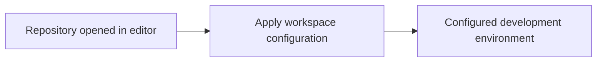

# Vscode

<!-- directory-responsibility -->
Configures editor extensions, settings, and integrations for this checkout.

Key files: `extensions.json`, `mcp.json`, `settings.json`.

```mermaid
flowchart LR
    A["Repository opened in editor"] --> B["Apply workspace configuration"]
    B --> C["Configured development environment"]
```
