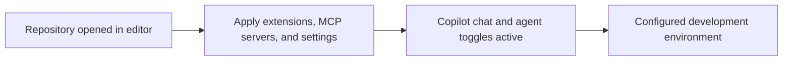

# Vscode

<!-- directory-responsibility -->
Configures editor extensions, settings, and integrations for this checkout.

Key files: `extensions.json` (recommended extensions), `mcp.json` (MCP server definitions), and `settings.json`, which holds the Copilot chat and agent feature toggles — including `chat.viewSessions.enabled` for the chat session view and the subagent/skill-adherence switches — alongside format-on-save and TypeScript import organization.

Git tracking defaults to exclusion. Each tracked directory owns a `.gitignore` that explicitly allows its important immediate files and child directories. Add an allowlist entry when introducing content intended for version control, and give each new child directory its own `.gitignore`. This repository applies the workspace policy independently; its root rules cover root entries only.
