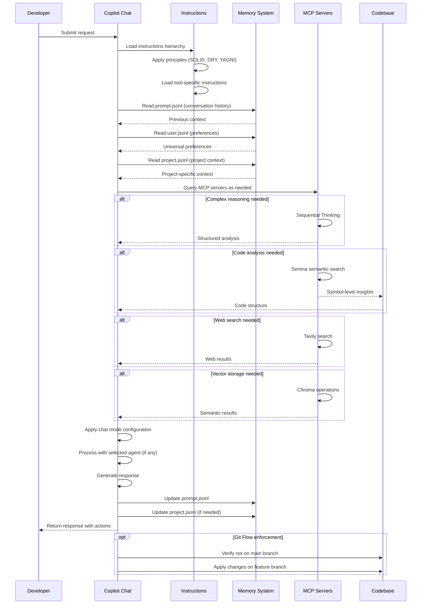
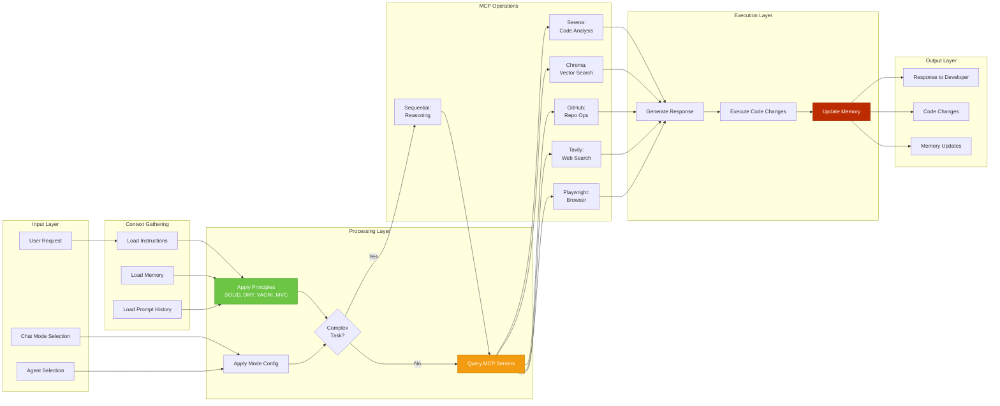

# @anoblet/copilot

> A comprehensive GitHub Copilot enhancement framework that extends your AI coding assistant with custom instructions, agents, prompts, and intelligent memory systems.

[](https://pnpm.io/)
[](LICENSE)

---

## 🎯 Overview

This project provides a sophisticated customization layer for GitHub Copilot, transforming it into a context-aware, principle-driven development companion. It integrates multiple MCP (Model Context Protocol) servers, implements a dual memory system, and enforces best practices through comprehensive instruction sets.

### Key Highlights

- 🧠 **Dual Memory System** - Separate user and project memory for context persistence
- 🤖 **Custom Agents** - Specialized agents for planning and implementation
- 🎨 **Chat Modes** - Optimized configurations for Claude Sonnet 4, GPT-5, and GPT-5 Mini
- 📝 **Reusable Prompts** - Pre-built prompts for common development tasks
- 🔧 **MCP Integration** - Seamless integration with 8+ Model Context Protocol servers
- 📐 **Development Principles** - Built on SOLID, DRY, YAGNI, and MVC principles
- 🌿 **Git Flow Workflow** - Structured branching model for professional development

---

## 🏗️ Architecture

The framework operates as a configuration layer between you and GitHub Copilot, providing a comprehensive system of instructions, agents, memory, and MCP server integrations.

### System Architecture

```mermaid
graph TB
    subgraph "Developer Interface"
        DEV[Developer]
    end

    subgraph "GitHub Copilot Layer"
        COPILOT[GitHub Copilot]
        CHAT[Copilot Chat]
    end

    subgraph "Framework Core"
        INST[Instructions]
        AGENTS[Agents]
        MODES[Chat Modes]
        PROMPTS[Prompts]
        MEM[Memory System]
        MCP[MCP Servers]
    end

    subgraph "Instructions Hierarchy"
        INST_MAIN[index.instructions.md]
        INST_GIT[git-flow.instructions.md]
        INST_PRIN[principles.instructions.md]
        INST_PROMPT[prompt.instructions.md]
        INST_TOOLS[tools.instructions.md]
        INST_TOOL_SEQ[sequential-thinking]
        INST_TOOL_SER[serena]
        INST_TOOL_MEM[memory]
        INST_TOOL_CHR[chroma]
        INST_TOOL_PW[playwright]
    end

    subgraph "Memory Architecture"
        MEM_USER[User Memory<br/>user.jsonl]
        MEM_PROJ[Project Memory<br/>project.jsonl]
        MEM_PROMPT[Prompt Memory<br/>prompt.jsonl]
    end

    subgraph "MCP Server Ecosystem"
        MCP_CHROMA[Chroma<br/>Vector DB]
        MCP_GITHUB[GitHub<br/>Repository Mgmt]
        MCP_PLAYWRIGHT[Playwright<br/>Browser Automation]
        MCP_SEQ[Sequential Thinking<br/>Complex Reasoning]
        MCP_SERENA[Serena<br/>Semantic Code Analysis]
        MCP_TAVILY[Tavily<br/>Web Search]
        MCP_TIME[Time<br/>Timezone Utils]
        MCP_CONTEXT7[Context7<br/>Enhanced Context]
    end

    subgraph "Agent System"
        AGENT_PLAN[Plan Agent<br/>plan.agent.md]
        AGENT_MERMAID[Mermaid Agent<br/>mermaid.agent.md]
    end

    subgraph "Chat Mode Configuration"
        MODE_CLAUDE[Claude Sonnet 4]
        MODE_GPT5[GPT-5]
        MODE_GPT5MINI[GPT-5 Mini]
    end

    subgraph "Prompt Library"
        P_ALIGN[align]
        P_COMPLEX[complexity]
        P_LEARN[learn]
        P_MAINT[maintenance]
        P_ORG[organize-memory]
        P_TASKS[tasks]
        P_MORE[... 15+ prompts]
    end

    DEV --> CHAT
    CHAT --> COPILOT
    COPILOT --> INST
    COPILOT --> AGENTS
    COPILOT --> MODES
    COPILOT --> PROMPTS
    COPILOT --> MEM
    COPILOT --> MCP

    INST --> INST_MAIN
    INST_MAIN --> INST_GIT
    INST_MAIN --> INST_PRIN
    INST_MAIN --> INST_PROMPT
    INST_MAIN --> INST_TOOLS
    INST_TOOLS --> INST_TOOL_SEQ
    INST_TOOLS --> INST_TOOL_SER
    INST_TOOLS --> INST_TOOL_MEM
    INST_TOOLS --> INST_TOOL_CHR
    INST_TOOLS --> INST_TOOL_PW

    MEM --> MEM_USER
    MEM --> MEM_PROJ
    MEM --> MEM_PROMPT

    MCP --> MCP_CHROMA
    MCP --> MCP_GITHUB
    MCP --> MCP_PLAYWRIGHT
    MCP --> MCP_SEQ
    MCP --> MCP_SERENA
    MCP --> MCP_TAVILY
    MCP --> MCP_TIME
    MCP --> MCP_CONTEXT7

    AGENTS --> AGENT_PLAN
    AGENTS --> AGENT_MERMAID

    MODES --> MODE_CLAUDE
    MODES --> MODE_GPT5
    MODES --> MODE_GPT5MINI

    PROMPTS --> P_ALIGN
    PROMPTS --> P_COMPLEX
    PROMPTS --> P_LEARN
    PROMPTS --> P_MAINT
    PROMPTS --> P_ORG
    PROMPTS --> P_TASKS
    PROMPTS --> P_MORE

    style COPILOT fill:#4078c0,stroke:#2d5d8e,color:#fff
    style INST fill:#6cc644,stroke:#4a9c2e,color:#fff
    style MEM fill:#bd2c00,stroke:#8b2200,color:#fff
    style MCP fill:#f39c12,stroke:#c87f0a,color:#fff
```



### Request Flow Sequence



### Processing Flow



---

## 📁 Directory Structure

```
copilot/
├── .github/                    # GitHub configuration
│   └── copilot-instructions.md # Main instruction entry point
├── .vscode/                    # VS Code configuration
│   ├── mcp.json               # MCP server configurations
│   └── settings.json          # Chat mode and prompt locations
├── agents/                     # Custom chat agents
│   └── plan.agent.md          # Planning agent with implementation handoff
├── chatmodes/                  # AI model-specific configurations
│   ├── claude-sonnet-4.chatmode.md
│   ├── gpt-5-mini.chatmode.md
│   └── gpt-5.chatmode.md
├── genaisrc/                   # GenAI source code (empty, reserved)
├── instructions/               # Comprehensive development instructions
│   ├── index.instructions.md   # Main instruction index
│   ├── git-flow.instructions.md
│   ├── principles.instructions.md
│   ├── tools/                  # Tool-specific instructions
│   │   ├── chroma.instructions.md
│   │   ├── memory.instructions.md
│   │   ├── sequential-thinking.instructions.md
│   │   └── serena.instructions.md
│   └── memory/                 # Memory-specific instructions
├── memory/                     # Persistent memory storage
│   ├── user.jsonl             # User preferences and personal info
│   ├── project.jsonl          # Project-specific context
│   ├── prompt.jsonl           # Conversation history
│   └── README.md              # Memory system documentation
├── prompts/                    # Reusable task prompts
│   ├── align.prompt.md
│   ├── complexity.prompt.md
│   ├── learn.prompt.md
│   ├── maintenance.prompt.md
│   ├── organize-memory.prompt.md
│   └── ... (15+ prompts total)
└── bootstrap/                  # Initialization utilities
    ├── index.ts
    └── README.md
```

---

## 🔌 MCP Servers

The framework integrates the following Model Context Protocol servers:

| Server | Purpose | Technology |
|--------|---------|------------|
| **Chroma** | Vector database for semantic memory and document storage | `uvx chroma-mcp` |
| **Context7** | Enhanced context retrieval and analysis | HTTP API |
| **GitHub** | Repository management, PRs, and code search | HTTP API |
| **Playwright** | Browser automation and UI testing | `npx @playwright/mcp` |
| **Sequential Thinking** | Complex reasoning and task breakdown | `npx @modelcontextprotocol/server-sequential-thinking` |
| **Serena** | Semantic code analysis and symbol navigation | `uvx serena` |
| **Tavily** | Web search and content extraction | `npx tavily-mcp` |
| **Time** | Timezone conversion and current time queries | `uvx mcp-server-time` |

---

## 🚀 Getting Started

### Prerequisites

- **VS Code** with GitHub Copilot extension
- **Node.js** (for npx commands)
- **Python** with `uvx` (for Python-based MCP servers)
- **pnpm** package manager (`npm install -g pnpm`)
- **Git** with Git Flow extensions

### Installation

1. **Clone the repository:**
   ```bash
   git clone <repository-url>
   cd copilot
   ```

2. **Run the bootstrap process:**
   ```bash
   cd copilot
   git submodule init
   git submodule update --remote
   ```

3. **Configure VS Code:**
   - Add `"chat.tools.global.autoApprove": true` to your user settings
   - Create soft links to the `.github` directory as defined in `../bootstrap.json`

4. **Configure API keys:**
   - When prompted, enter your Tavily API key for web search capabilities
   - Add Context7 API key if you have one (optional)

5. **Restart VS Code** to activate all MCP server configurations

### Verification

Open GitHub Copilot Chat and verify:
- Custom chat modes appear in the mode selector
- Custom prompts are available
- Memory systems are accessible
- MCP servers are connected (check status indicator)

---

## 💡 Usage

### Chat Modes

Access optimized AI configurations through the chat mode selector:

- **Claude Sonnet 4** - Autonomous task completion with deep understanding and quality focus
- **GPT-5** - Advanced reasoning with high effort enabled
- **GPT-5 Mini** - Faster responses for simpler tasks

Each mode includes:
- Model-specific optimizations
- Context gathering protocols
- Quality assurance guidelines
- Memory management instructions

### Prompts

Invoke reusable prompts from the command palette or chat:

| Prompt | Purpose |
|--------|---------|
| `align` | Align project with PROMPT.md and complete TASKS.md |
| `complexity` | Analyze and report code complexity |
| `learn` | Extract lessons learned from conversations |
| `maintenance` | Clean up legacy code and comments |
| `organize-memory` | Structure memory entities into categories |
| `mermaid` | Generate Mermaid diagrams |
| `summarize` | Create conversation summaries |
| `tasks` | Generate task lists from requirements |

### Agents

Specialized agents for multi-step workflows:

**Plan Agent** (`@plan`)
- Creates detailed implementation plans
- Breaks tasks into actionable steps
- Sorts by time complexity
- Hands off to implementation agent
- Outputs to `PLAN.md`

### Memory System

The framework maintains three separate memory systems:

1. **User Memory** (`memory/user.jsonl`)
   - Personal information and preferences
   - Universal development standards
   - Technology preferences
   - Persistent across all projects

2. **Project Memory** (`memory/project.jsonl`)
   - Project-specific context and goals
   - Architecture decisions
   - Current work state
   - Isolated per project

3. **Prompt Memory** (`memory/prompt.jsonl`)
   - Conversation history
   - Context continuity
   - Session state

**Usage:**
```markdown
# Read from user memory
Use user-memory to get development preferences

# Read from project memory
Use project-memory to get current project goals

# Write to appropriate memory
Record this preference in user-memory
Record this architecture decision in project-memory
```

---

## 📐 Development Principles

This framework enforces the following principles through instructions:

### SOLID Principles
- **S**ingle Responsibility
- **O**pen/Closed
- **L**iskov Substitution
- **I**nterface Segregation
- **D**ependency Inversion

### Additional Principles
- **DRY** (Don't Repeat Yourself)
- **YAGNI** (You Aren't Gonna Need It)
- **MVC** (Model-View-Controller)

### Quality Philosophy
- **Quality over speed** - Take time for proper analysis and validation
- **Understanding first** - Deeply understand goals before taking action
- **Memory-driven** - Record context before, during, and after work
- **Sequential thinking** - Use structured reasoning for complex tasks
- **Iterative refinement** - Reflect and improve based on results

---

## 🌿 Git Flow Workflow

The project follows the [Git Flow](instructions/git-flow.instructions.md) branching model:

### Branch Types

- **`main`** - Production-ready code (protected)
- **`development`** - Integration branch for features
- **`feature/*`** - New features
- **`bugfix/*`** - Bug fixes
- **`release/*`** - Release preparation
- **`hotfix/*`** - Critical production fixes
- **`support/*`** - Long-term support branches

### Common Commands

```bash
# Start a new feature
git flow feature start feature-name

# Finish a feature (merges to development)
git flow feature finish feature-name

# Start a release
git flow release start 1.0.0

# Finish a release (creates tag, merges to main and development)
git flow release finish 1.0.0

# Start a hotfix
git flow hotfix start 1.0.1
```

### Important Rules

⚠️ **NEVER update the main branch directly** (unless working in `.copilot` or `.copilot/genaisrc` submodules)

---

## 🤝 Contributing

Contributions are welcome! Please follow these guidelines:

1. **Follow Git Flow** - Use appropriate branch types
2. **Apply principles** - SOLID, DRY, YAGNI, MVC
3. **Update memory** - Document context and decisions
4. **Write instructions** - Add instruction files for new capabilities
5. **Test thoroughly** - Validate changes across different scenarios
6. **Be thoughtful** - Quality over speed, understanding over assumptions

---

## 🔍 Advanced Features

### Sequential Thinking

The Sequential Thinking MCP server is used for all complex reasoning:
```markdown
Use sequential thinking to:
- Break down this complex requirement
- Plan the implementation approach
- Identify dependencies and constraints
```

### Serena Semantic Analysis

Leverage Serena for code understanding:
```markdown
Use Serena to:
- Find all database query functions
- Analyze cross-system dependencies
- Show symbol-level insights for this function
- Create a memory about system integration
```

### Chroma Vector Storage

Store and retrieve semantic context:
- Record prompts before starting work
- Store summaries after completing tasks
- Query similar past work for context
- Build knowledge base over time

---

## 📚 Inspiration

This project draws inspiration from:
- [astronautical-apogee](https://github.com/anoblet/astronautical-apogee)
- [lit-cms](https://github.com/anoblet/lit-cms)
- [my-project](https://github.com/anoblet/my-project)

---

## 📄 License

ISC

---

## 👤 Author

**Andrew Noblet** ([@anoblet](https://github.com/anoblet))

---

## 🙏 Acknowledgments

This framework leverages the incredible work of:
- GitHub Copilot team
- Model Context Protocol (MCP) community
- Open source MCP server developers
- Git Flow methodology by Vincent Driessen

---

## 📞 Support

For questions, issues, or contributions, please:
- Open an issue on GitHub
- Follow the contribution guidelines above
- Consult the instruction files in `instructions/`

---

**Built with ❤️ for developers who value thoughtful, principle-driven development**