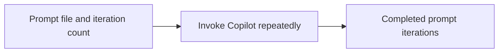

# Cli

<!-- directory-responsibility -->
Wraps the Copilot command to repeat file-based prompts for a configured number of iterations.

Detailed usage and existing reference material: [README.md](README.md).

Key files: `package.json`, `specification.md`, `tsconfig.json`.

Git tracking defaults to exclusion. Each tracked directory owns a `.gitignore` that explicitly allows its important immediate files and child directories. Add an allowlist entry when introducing content intended for version control, and give each new child directory its own `.gitignore`. This repository applies the workspace policy independently; its root rules cover root entries only. Existing responsibilities and the diagram remain unchanged.
