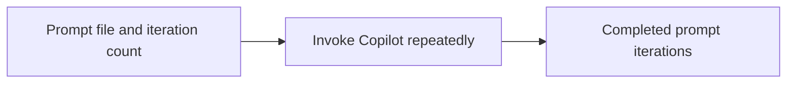

# Cli

<!-- directory-responsibility -->
Wraps the Copilot command to repeat file-based prompts for a configured number of iterations.

Detailed usage and existing reference material: [README.md](README.md).

Key files: `package.json`, `specification.md`, `tsconfig.json`.

