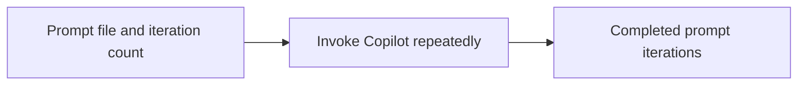

# Src

<!-- directory-responsibility -->
Implements the cli package behavior. Wraps the Copilot command to repeat file-based prompts for a configured number of iterations.

Key files: `index.ts`.

```mermaid
flowchart LR
    A["Prompt file and iteration count"] --> B["Invoke Copilot repeatedly"]
    B --> C["Completed prompt iterations"]
```
