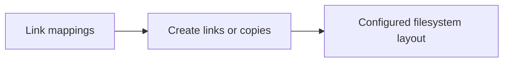

# Link

<!-- directory-responsibility -->
Applies JSON mappings as symbolic links or materialized copies and verifies the configured mappings.

Detailed usage and existing reference material: [README.md](README.md).

Key files: `link.json`, `package.json`, `specification.md`.

Git tracking defaults to exclusion. Each tracked directory owns a `.gitignore` that explicitly allows its important immediate files and child directories. Add an allowlist entry when introducing content intended for version control, and give each new child directory its own `.gitignore`. This repository applies the workspace policy independently; its root rules cover root entries only. Existing responsibilities and the diagram remain unchanged.
